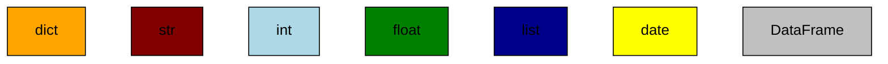
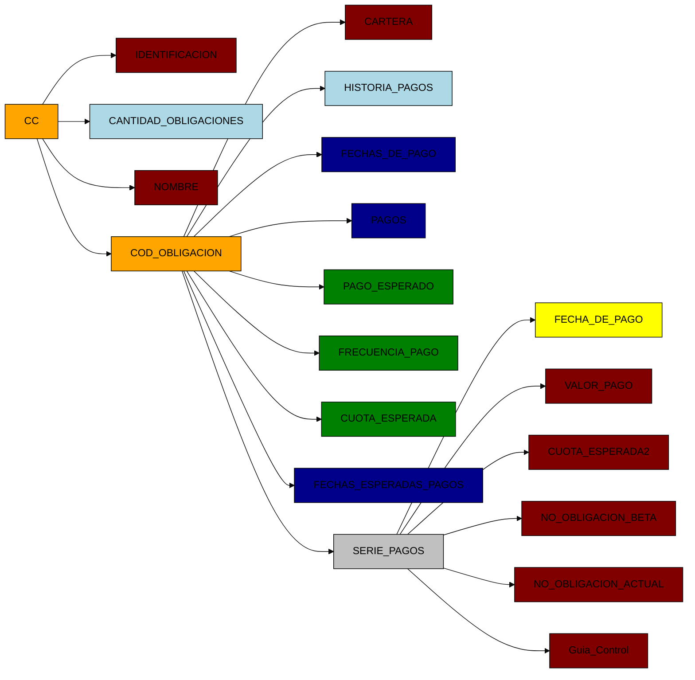
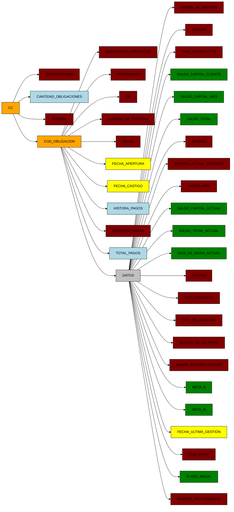
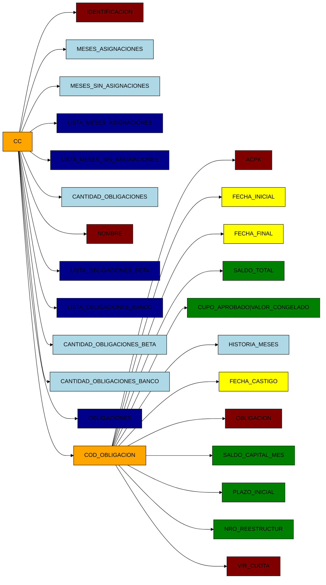
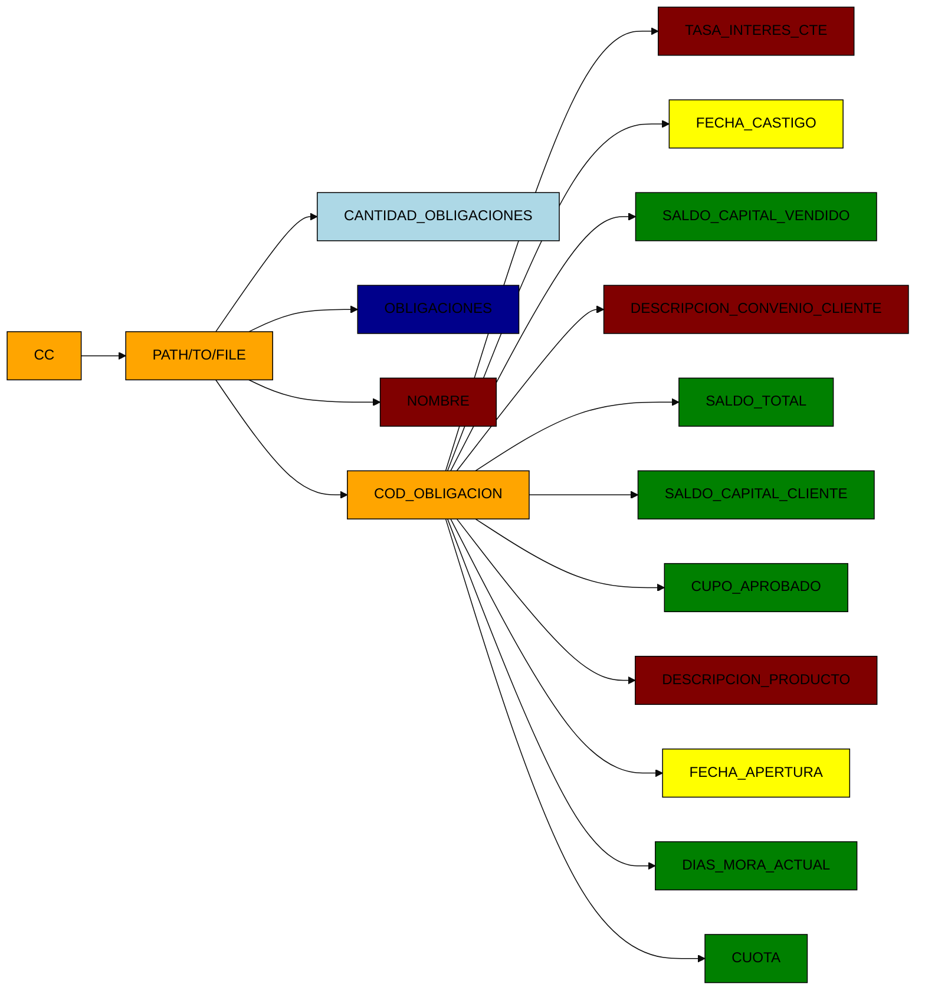

# Colors

#  FILE: Dicc_Datos_Propia_Pagos.pickle 14260681 MB

# FILE : Dicc_Datos_Propia_Evolucion.pickle 481264542 MB

# FILE : Dicc_Datos_Propia_Asignacion.pickle 481264542 MB

# FILE : Diciccionario_Retornar.pickle 14160 MB

